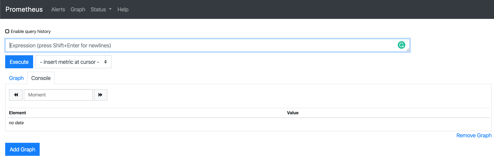
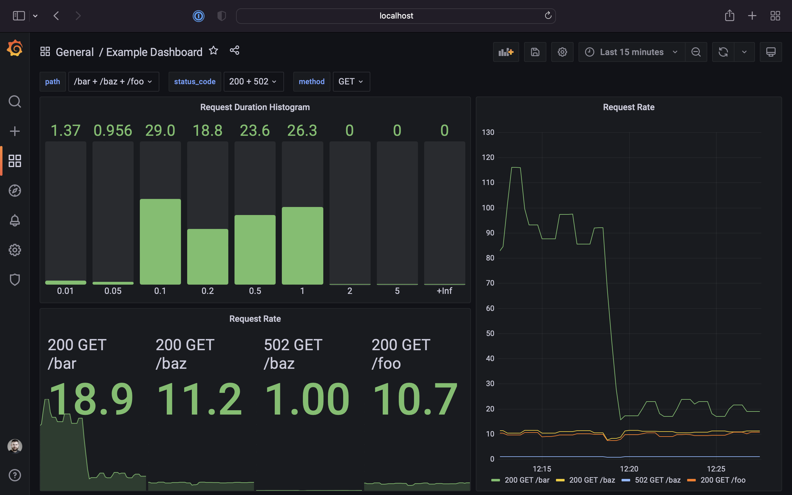
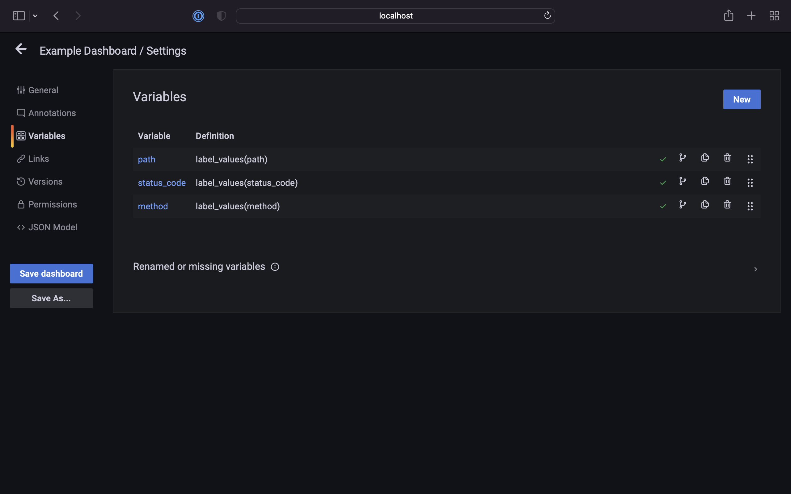
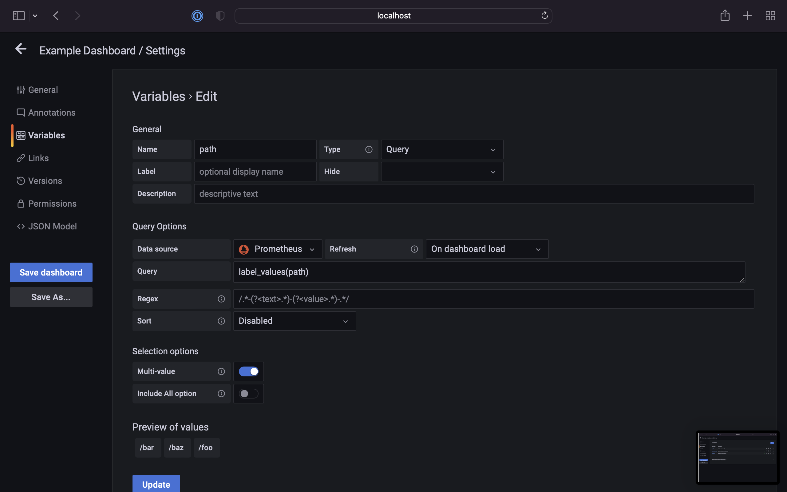
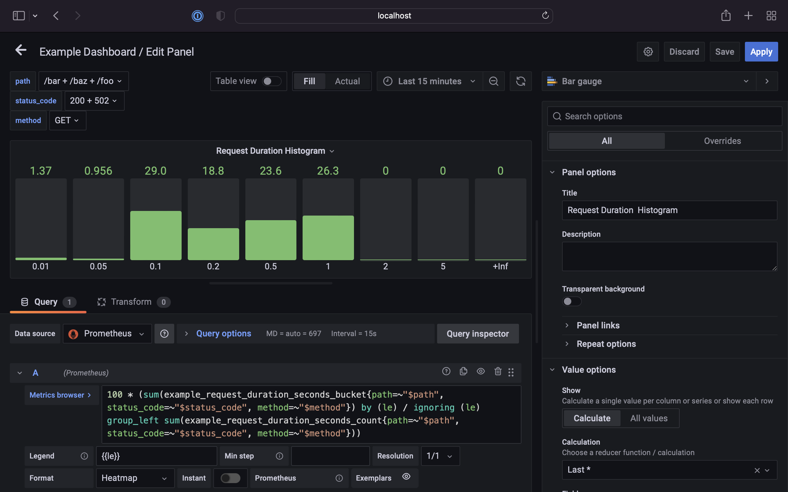
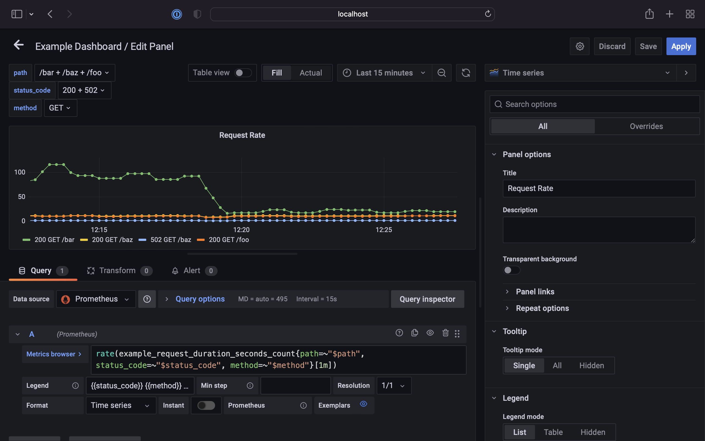
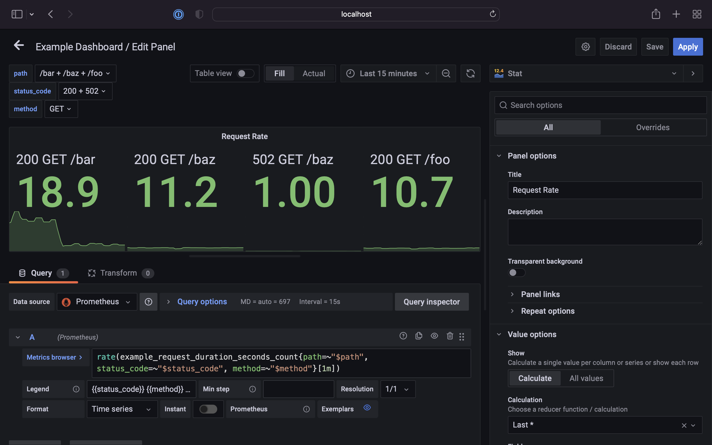

[Ondrej Sika (sika.io)](https://which.sika.io) | <ondrej@sika.io> | [course ->](#course) | [install ->](#install-prometheus-locally)


# Prometheus Training

Source of my Prometheus Training

## About Course

- [Proetheus Training in Czech Republic](https://ondrej-sika.cz/skoleni/prometheus?_s=gh-prometheus-training)
- [Proetheus Training in Europe & Middle East](https://ondrej-sika.com/training/prometheus?_s=gh-prometheus-training)

### Any Questions?

Write me mail to <ondrej@sika.io>

### Related Courses

- [Kubernetes Training in Czech Republic](https://ondrej-sika.cz/skoleni/kubernetes?x_source=github-ondrejsika-prometheus-training&_s=gh-prometheus-training)
- [Kubernetes Training in Europe & Middle East](https://ondrej-sika.com/training/kubernetes?x_source=github-ondrejsika-prometheus-training&_s=gh-prometheus-training)

## About Me - Ondrej Sika

**DevOps Engineer, Consultant & Lecturer**

Git, Gitlab, Gitlab CI, Docker, Kubernetes, Terraform, Prometheus, ELK / EFK

## DevOps Live

<https://devopslive.cz>

## DevOps Kniha (kniha.sika.io)

<https://kniha.sika.io>

## Star, Create Issues, Fork, and Contribute

Feel free to star this repository or fork it.

If you found bug, create issue or pull request.

Also feel free to propose improvements by creating issues.

## Chat

For sharing links & "secrets".

- Slack - <https://sikapublic.slack.com/>
- MS Teams
- <https://sika.link/chat>

<!-- BEGIN Install -->

## Install Prometheus Locally

<!-- BEGIN Install Mac -->

### Mac

```
brew install sikalabs/tap/slu
brew install prometheus
brew install thanos
sudo slu install-bin alertmanager
```

<!-- END Install Mac -->

<!-- BEGIN Install Linux -->

### Linux

Install [slu](https://github.com/sikalabs/slu)

```
curl -fsSL https://raw.githubusercontent.com/sikalabs/slu/master/install.sh | sudo sh
```

Install tools

```
sudo slu install-bin prometheus
sudo slu install-bin alertmanager
sudo slu install-bin thanos
```

<!-- END Install Linux -->

<!-- END Install -->

## Course

## Agenda

- Prometheus
  - Intro
  - Install Prometheus
  - Basic configuration
  - Scraping & Exporters
  - Push Gateway
  - PromQL
  - Alerting
- Alert Manager
  - Install Alert Manager
  - Routes
  - Receivers
- Grafana
  - Instal Grafana
  - Working with dashboards
  - Prometheus integration

## What is Prometheus?

Prometheus is an open-source systems monitoring and alerting toolkit originally built at SoundCloud. Since its inception in 2012, many companies and organizations have adopted Prometheus, and the project has a very active developer and user community. It is now a standalone open source project and maintained independently of any company. To emphasize this, and to clarify the project's governance structure, Prometheus joined the Cloud Native Computing Foundation in 2016 as the second hosted project, after Kubernetes. -- [Prometheus website](https://prometheus.io/docs/introduction/overview/#what-is-prometheus)

### Prometheus Features

- time series DB
- PromQL - a flexible query language
- metrics scraping
- support for push metrics (Push Gateway)
- service discovery & static config
- many exporters
- alert manager

### Prometheus Architecture


### Metric Types

- Counter
- Gauge
- Histogram
- Summary

#### Counter

A counter is a cumulative metric that represents a single monotonically increasing counter whose value can only increase or be reset to zero on restart. For example, you can use a counter to represent the number of requests served, tasks completed, or errors.

#### Gauge

A gauge is a metric that represents a single numerical value that can arbitrarily go up and down.

Gauges are typically used for measured values like temperatures or current memory usage, but also "counts" that can go up and down, like the number of concurrent requests.

#### Histogram

A histogram samples observations (usually things like request durations or response sizes) and counts them in configurable buckets. It also provides a sum of all observed values.

A histogram with a base metric name of `<basename>` exposes multiple time series during a scrape:

- cumulative counters for the observation buckets, exposed as `<basename>_bucket{le="<upper inclusive bound>"}`
- the total sum of all observed values, exposed as `<basename>_sum`
- the count of events that have been observed, exposed as `<basename>_count (identical to <basename>_bucket{le="+Inf"}` above)

## Run Prometheus

### Test Prometheus with Simple Config

Run

```
prometheus --config.file=prom-self-monitor.yml
```

or

```
./run-prometheus.sh prom-self-monitor.yml
```

See <http://127.0.0.1:9090>



Examples:

- http://127.0.0.1:9090/graph?g0.expr=rate(prometheus_http_requests_total%7Bhandler%3D%22%2Fmetrics%22%7D%5B1m%5D)&g0.tab=0&g0.stacked=0&g0.range_input=1h&g1.expr=prometheus_http_requests_total%7Bhandler%3D%22%2Fmetrics%22%7D&g1.tab=0&g1.stacked=0&g1.range_input=1h

### Run Example Metrics Generator (using slu)

```
slu metrics-generator server
slu metrics-generator server -p 8001
slu metrics-generator server -p 8002
```

or in Docker

```
docker run --name metgen0 -d -p 8000:8000 sikalabs/slu:v0.56.0-dev-1 slu metrics-generator server
docker run --name metgen1 -d -p 8001:8000 sikalabs/slu:v0.56.0-dev-1 slu metrics-generator server
docker run --name metgen2 -d -p 8002:8000 sikalabs/slu:v0.56.0-dev-1 slu metrics-generator server
```

Run Prometheus with those sample targets

```
prometheus --config.file=prom-basic.yml
```

or

```
./run-prometheus.sh prom-basic.yml
```

See:

- <http://127.0.0.1:9090>
- http://127.0.0.1:9090/graph?g0.expr=sum(rate(example_request_duration_seconds_count%5B1m%5D))%20by%20(instance)&g0.tab=1&g0.stacked=0&g0.show_exemplars=0&g0.range_input=1h

## Prometeheus Exporters

### What are Prometeheus Exporters?

There are a number of libraries and servers which help in exporting existing metrics from third-party systems as Prometheus metrics. This is useful for cases where it is not feasible to instrument a given system with Prometheus metrics directly (for example, HAProxy or Linux system stats).

#### Popular exporters:

- Node Exporter (official) - <https://github.com/prometheus/node_exporter>
- Blackbox Exporter (official) - <https://github.com/prometheus/blackbox_exporter>
- cAdvisor (Docker) - <https://github.com/google/cadvisor>
- Kube State Metrics - <https://github.com/kubernetes/kube-state-metrics>
- MySQL Exporter (official) - <https://github.com/prometheus/mysqld_exporter>
- Postgres Exporter - <https://github.com/wrouesnel/postgres_exporter>

All exporters are on Prometheus website: <https://prometheus.io/docs/instrumenting/exporters/>
Defult ports of exporters: <https://github.com/prometheus/prometheus/wiki/Default-port-allocations>

### Node Exporter

[source](https://github.com/prometheus/node_exporter)

Install on host using Docker:

```
docker run --name node-exporter -d --net=host --pid=host -v /:/host:ro,rslave quay.io/prometheus/node-exporter --path.rootfs=/host
```

See: <http://prom.sikademo.com:9100/metrics>

Example for Mac (without rootfs and host network)

```
docker run --name node-exporter -d -p 9100:9100 --pid=host quay.io/prometheus/node-exporter
```

### Blackbox Exporter

[source](https://github.com/prometheus/blackbox_exporter)

Install on host using Docker:

```
docker run --rm -d -p 9115:9115 --name blackbox_exporter -v $(pwd)/blackbox_exporter:/etc/blackbox_exporter prom/blackbox-exporter:master
```

See: <http://prom.sikademo.com:9115/metrics>

Check status code 200 on website:

- sika.io: <http://prom.sikademo.com:9115/probe?module=http_2xx&target=https://sika.io>
- foo.int (not working): <http://prom.sikademo.com:9115/probe?module=http_2xx&target=https://foo.int>

Run Prometheus with balackbox_exporter config:

```
prometheus --config.file=prom-balackbox.yml
```

or

```
./run-prometheus.sh prom-balackbox.yml
```

### cAdvisor

[source](https://github.com/google/cadvisor)

Install on host using Docker:

```
docker run --volume=/:/rootfs:ro --volume=/var/run:/var/run:ro --volume=/sys:/sys:ro --volume=/var/lib/docker/:/var/lib/docker:ro --volume=/dev/disk/:/dev/disk:ro --publish=9338:9338 --detach=true --name=cadvisor gcr.io/cadvisor/cadvisor --port=9338
```

See:

- Metrics: <http://prom.sikademo.com:9338/metrics>
- Dashboard: <http://prom.sikademo.com:9338/>

## PromQL

- http://prom.sikademo.com:9090/
- http://prom.sikademo.com:9090/targets
- http://prom.sikademo.com:9090/graph?g0.expr=node_load1&g0.tab=0&g0.stacked=0&g0.range_input=1h

Select time series

```
node_network_receive_bytes_total
```

```
{__name__="node_network_receive_bytes_total"}
```

```
node_network_receive_bytes_total / {__name__="node_network_receive_bytes_total"}
```

See: http://prom.sikademo.com:9090/graph?g0.expr=node_network_receive_bytes_total%20%2F%20%7B__name__%3D%22node_network_receive_bytes_total%22%7D&g0.tab=1&g0.stacked=0&g0.show_exemplars=0&g0.range_input=1h&g1.expr=node_network_receive_bytes_total&g1.tab=1&g1.stacked=0&g1.show_exemplars=0&g1.range_input=1h

Select time series by label

```
node_network_receive_bytes_total{device="eth0"}
```

```
node_network_receive_bytes_total{device!="lo"}
```

Regular Expressions

```
node_network_receive_bytes_total{device=~"eth.+"}
```

```
node_network_receive_bytes_total{device!~"eth.+"}
```

```
node_network_receive_bytes_total{device=~"eth0|lo"}
```

```
{__name__=~"node_network_(receive|transmit)_bytes_total"}
```

Offset

```
node_network_receive_bytes_total offset 1h
```

Rates

```
rate(node_network_receive_bytes_total[5m])
```

`rate` vs `irate`

- `rate()` is generally used when graphing the slow moving counters.
- `irate()` is used when graphing the high volatile counters.

Source: https://medium.com/@kavyaprathyusha/rate-vs-irate-in-promql-a172e3d9c38f

### Examples

CPU usage in percent

```
100 * (1 - avg(rate(node_cpu_seconds_total{mode="idle"}[1m]))  by (instance))
```

Memory usage in percent

```
100 * (node_memory_Active_bytes / on (instance) node_memory_MemTotal_bytes)
```

Disk Usage in Percent

```
100 * (node_filesystem_avail_bytes{fstype!~"tmpfs|fuse.lxcfs|squashfs|vfat"} / node_filesystem_size_bytes{fstype!~"tmpfs|fuse.lxcfs|squashfs|vfat"})
```

Network transmit in kbps

```
sum(rate(node_network_transmit_bytes_total{device=~"eth.*|enp.*"}[10m])) by (instance)
```

CPU Count

```
count without(cpu, mode) (node_cpu_seconds_total{mode="idle"})
```

See: http://prom.sikademo.com:9090/graph?g0.expr=count%20without(cpu%2C%20mode)%20(node_cpu_seconds_total%7Bmode%3D%22idle%22%7D)%20&g0.tab=1&g0.stacked=0&g0.show_exemplars=0&g0.range_input=1h

### Saved Queries

```
prometheus --config.file=prom-queries.yml
```

or

```
./run-prometheus.sh prom-queries.yml
```

## Service Discovery

### Service Discovery using DNS

```
prometheus --config.file=prom-sd-dns.yml
```

or

```
./run-prometheus.sh prom-sd-dns.yml
```

### Service Discovery using file

Copy `service-discovery-file.example.yml` to `service-discovery-file.yml`

```
cp service-discovery-file.example.yml service-discovery-file.yml
```

```
prometheus --config.file=prom-sd-file.yml
```

or

```
./run-prometheus.sh prom-sd-dns.yml
```

### Service Discovery using Consul

```
prometheus --config.file=prom-sd-consul.yml
```

or

```
./run-prometheus.sh prom-sd-consul.yml
```

## Push Gateway

Install Push Gateway using Docker:

```
docker run --name push-gateway -d -p 9091:9091 prom/pushgateway
```

See:

- Web UI: <http://prom.sikademo.com:9091/>
- Metrics: <http://prom.sikademo.com:9091/metrics>

### Examples

Push with label `{job="some_job"}`

```
echo "demo 3.14" | curl --data-binary @- http://prom.sikademo.com:9091/metrics/job/some_job
```

Push with label `{job="other_job",instance="some_instance"}`

```
cat <<EOF | curl --data-binary @- http://prom.sikademo.com:9091/metrics/job/some_job/instance/some_instance
# TYPE some_metric counter
some_metric{label="val1"} 42
# TYPE another_metric gauge
# HELP another_metric Just an example.
another_metric 2398.283
EOF
```

Delete metrics from Push Gateway:

```
curl -X DELETE http://prom.sikademo.com:9091/metrics/job/some_job
```

```
curl -X DELETE http://prom.sikademo.com:9091/metrics/job/some_job/instance/some_instance
```

## Alertmanager

### Maildev

We'll use [maildev](https://github.com/maildev/maildev) on [maildev.sikademo.com](https://maildev.sikademo.com)

### Run Alertmanager Example

Run Random Metrics:

```
docker run --name random8080 -d -p 8080:80 ondrejsika/random-metrics
docker run --name random8081 -d -p 8081:80 ondrejsika/random-metrics
docker run --name random8082 -d -p 8082:80 ondrejsika/random-metrics
```

Run Prometheus with rules configuration

```
prometheus --config.file=prom-alert.yml
```

See: <http://localhost:9090/alerts>

and in other tab run Alertmanager

```
alertmanager --config.file am-basic.yml
```

See: <http://localhost:9093>

Stop random metrics:

```
docker stop random8080 random8081 random8082
```

See Alerts, Alertmanager and Emaildev. Start them and check again:

```
docker start random8080 random8081 random8082
```

### Multiple Receivers Example

Use `./set-probe_success.sh` script to set everything up

```
./set-probe_success.sh frontend 1
./set-probe_success.sh backend 1
./set-probe_success.sh db 1
./set-probe_success.sh lb 1
```

Run Prometheus & Alertmanager:

```
prometheus --config.file=04_prometheus.yml
```

```
alertmanager --config.file 04_alertmanager.yml
```

You can debug routes here: <https://prometheus.io/webtools/alerting/routing-tree-editor/>

Check Alerts & Alert Manager.

Fire some errors:

```
./set-probe_success.sh db 0
./set-probe_success.sh lb 0
```

Check Alerts, Alert Manager & MailDev.

Fix DB & LB and see Alerts, Alert Manager & MailDev again.

```
./set-probe_success.sh db 1
./set-probe_success.sh lb 1
```

### Jiralert

Send alert to Jira

https://github.com/prometheus-community/jiralert

## Grafana

### Grafana Screenshots













### Dashboards on Grafana.com

All dashboards are on: <https://grafana.com/grafana/dashboards>

My favourite dashboards:

- Node Exporter - `405` - https://grafana.com/grafana/dashboards/405
- Node Exporter - `11074` - https://grafana.com/grafana/dashboards/11074
- Postgres - `455` - https://grafana.com/grafana/dashboards/455
- Mysql - `6239` - https://grafana.com/grafana/dashboards/6239
- Traefik - `5851` - https://grafana.com/grafana/dashboards/5851
- Proxmox - `10347` - https://grafana.com/grafana/dashboards/10347
- Consul - `10642` - https://grafana.com/grafana/dashboards/10642

Kubernetes

- K8 Cluster Detail Dashboard - `10856` - https://grafana.com/grafana/dashboards/10856
- 10 Project/NameSpace Based on Memory - `10551` - https://grafana.com/grafana/dashboards/10551
- Cluster Monitoring for Kubernetes - `10000` - https://grafana.com/grafana/dashboards/10000

## Loki


[@wild.loki.appears](https://www.instagram.com/wild.loki.appears/)

[@loki](https://www.instagram.com/loki/)

```
helm upgrade --install loki loki \
  --repo https://grafana.github.io/helm-charts \
  --namespace loki \
  --create-namespace \
  --values loki-example/loki.values.yml
```

If you don't have Grafana, you can install it.

```
helm upgrade --install grafana grafana \
  --repo https://grafana.github.io/helm-charts \
  --namespace grafana \
  --create-namespace \
  --values loki-example/grafana.values.yml
```

```
helm upgrade --install promtail promtail \
  --repo https://grafana.github.io/helm-charts \
  --namespace promtail \
  --create-namespace \
  --values loki-example/promtail.values.yml
```

Run some demo logging

```
kubectl apply -f loki-example/loggen.yml -f loki-example/loggen-fast.yml -f loki-example/loggen-slow.yml -f loki-example/loggen-json.yml
```

Add Loki data source `http://loki-read.loki:3100`

Queries

```
{app="loggen"}
```

```
{app=~"loggen.*"} | line_format "{{ .node_name }} {{ .app }}"
```

```
{app=~"loggen.*"} |= "ERROR"
```

```
{app=~"loggen.*"} != "DEBUG"
```

```
{app=~"loggen.*"} != "DEBUG" != "INFO"
```

```
{app=~"loggen.*"} !~ "DEBUG|INFO"
```

```
{app=~"loggen.*"} | pattern `<_> <_> <_> <level> <message>` | line_format "{{ .app }} -- {{ .level }} -- {{ .message }}"
```

```
{app="json-loggen"}
```

```
{app="json-loggen"} | json
```

```
{app="json-loggen"} | json | line_format "{{ .app }} -- {{ .level }} -- {{ .message }}"
```

logctl

```
kubectl port-forward -n loki svc/loki-read 3100:3100
```

```
export LOKI_ADDR=http://127.0.0.1:3100
```

```
logcli query '{app="loggen-slow"} | pattern `<_> <_> <_> <level> <msg>` | line_format "{{ .app }} -- {{.level}} -- {{.msg}}"'
```

## Thanos

- https://thanos.io/
- https://thanos.io/tip/thanos/quick-tutorial.md/

### Thanos Example

```
cd thanos-example
```

Run multiple Prometheuses (in US & EU zone)

```
./run-prom-us.sh
```

```
./run-prom-eu.sh
```

Run sidecars for those Prometheuses

```
./run-thanos-sidecar-us.sh
```

```
./run-thanos-sidecar-eu.sh
```

Run Prometheus Query connected to sidecars

```
./run-thanos-query-sidecar.sh
```

Run Thanos Store for each sidecar data

```
./run-thanos-store-us.sh
```

```
./run-thanos-store-eu.sh
```

Run Prometheus Query connected to stores

```
./run-thanos-query-store.sh
```

## Thank you! & Questions?

That's it. Do you have any questions? **Let's go for a beer!**

### Ondrej Sika

- email: <ondrej@sika.io>
- web: <https://sika.io>
- twitter: [@ondrejsika](https://twitter.com/ondrejsika)
- linkedin: [/in/ondrejsika/](https://linkedin.com/in/ondrejsika/)
- Newsletter, Slack, Facebook & Linkedin Groups: <https://join.sika.io>

_Do you like the course? Write me recommendation on Twitter (with handle `@ondrejsika`) and LinkedIn (add me [/in/ondrejsika](https://www.linkedin.com/in/ondrejsika/) and I'll send you request for recommendation). **Thanks**._

Wanna to go for a beer or do some work together? Just [book me](https://book-me.sika.io) :)

## Resources

- Prometheus vs Others - https://prometheus.io/docs/introduction/comparison/

## Examples from Training

### 2022-10-24 Solargis

- https://github.com/sika-training-examples/2022-10-25-solargis-go-server-with-metrics

## Sources

- https://valyala.medium.com/promql-tutorial-for-beginners-9ab455142085
- https://medium.com/@kavyaprathyusha/rate-vs-irate-in-promql-a172e3d9c38f
